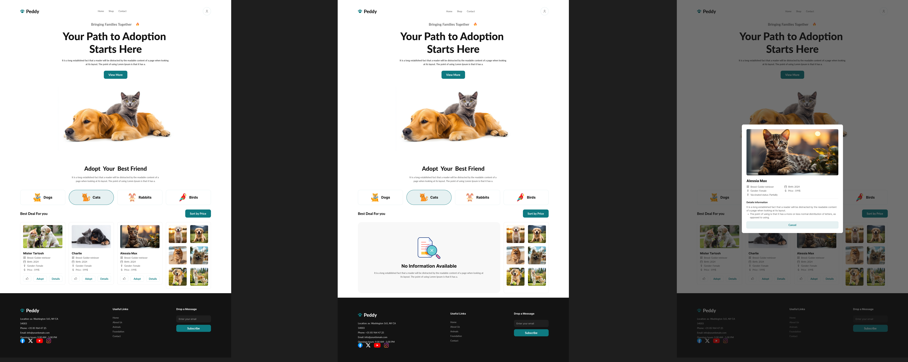

# Peddy - Your Path to Adoption Starts Here

## Description
Peddy is a responsive web platform that simplifies the pet adoption process by enabling users to view and adopt pets based on categories such as Dogs, Cats, Rabbits, and Birds. The platform fetches data dynamically from APIs, ensuring users have up-to-date information about available pets.

## Key Features
1. **Dynamic Category Filtering:** Users can browse pets by categories, dynamically fetched from the API.
2. **Modal for Pet Details:** Clicking the "Details" button opens a modal showcasing detailed information about the selected pet.
3. **Sort by Price:** Pets can be sorted in descending order of price to help users find their perfect match.
4. **Adoption Process:** A countdown (3, 2, 1) displays after clicking "Adopt" before marking the pet as adopted.
5. **Like Functionality:** Users can "like" pets, which adds the pet’s thumbnail to a grid on the right side of the page.

## ES6 Features Used
1. **Arrow Functions:** Utilized for concise function declarations.
2. **Template Literals:** Used for dynamic HTML generation and API integration.
3. **Async/Await:** Handles API calls and ensures smooth asynchronous operations.
4. **Try/Catch:** Used for handling errors gracefully during API calls and operations.
5. **Spinner Loading and SetInterval:** Displays a loading spinner while data is being fetched and utilizes `setInterval` for the adoption countdown.
6. **Sorting Functionality:** Implements sorting pets by price to enhance user experience.

## Preview

[Click here to view the live website](https://pet-adoption-srk.netlify.app/)

